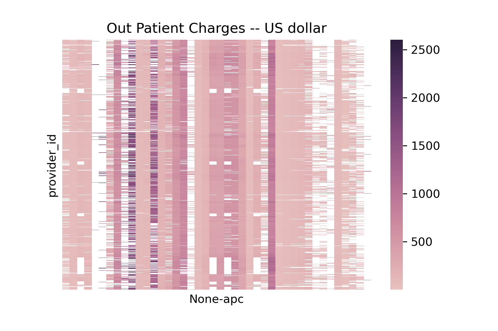
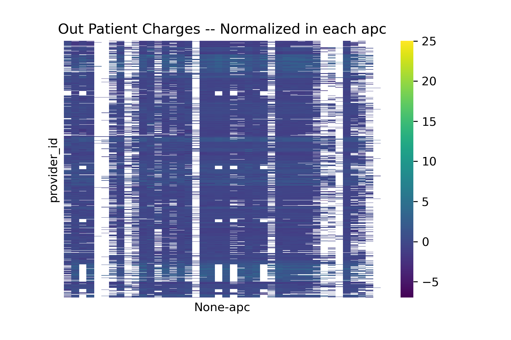

# Factors for different charges
The data from Kaggle cms-medicare database covers the US nationwide medicare bills from 3770 unique providers in the years of 2011-2015. 

## Providers and Services
Heatmaps display the charges per outpatient service by different providers (i.e., provder_id) and by type of service (i.e., Ambulatory Payment Classification, apc, n=42, labeled as None-apc below).      

     

