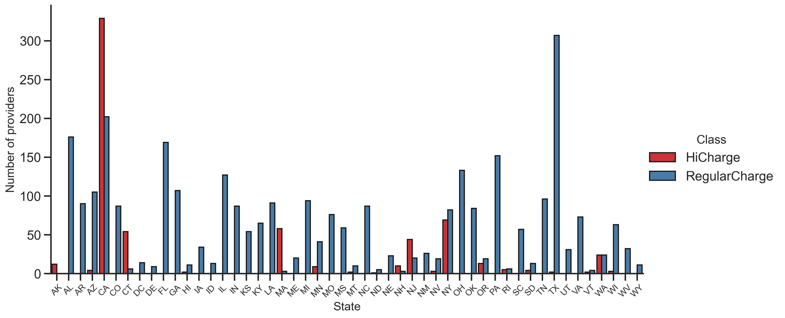

Data are from Kaggle CMS Medicare database, which covers the US nationwide Medicare bills from 3770 unique providers during the years of 2011-2015. 
# 1st asset - Do some providers bill higher than others? 

This heatmap displays the charges (in US dollars) per outpatient service, listed with different providers (i.e., provider_id), and with different type of services (i.e., Ambulatory Payment Classification, apc, n=42, labeled as "None-apc"). This plot shows that the amounts of charges primarily depend on the type of services.  
     

To evaluate if every provider charges equally compared to the peers, all the charges were normalized by the corresponding apc bills. The resulting plot shows that certain groups of providers tend to charge higher than others, irrespective types of apc services (i.e., see the providers with a persistent horizontal light-blue pattern).   

For these providers who tend to charge higher, do they file the claims more on some specific apc? In other words, are they tied to a certain specialists? To analyze this, I classified the providers into "RegularCharge" vs. "HiCharge" from the above blue heatmap, with the providers in the latter having a value larger or equal to 15. This led to a total of 650 providers (17%) in the HiCharge class. As shown below, the resulting distribution of total bills indicates that the HiCharge providers provide a comparable variety of services to the RegularCharge providers, revealing that the providers from both classes have a similar distribution of types of hospitals.      

Can a different US state's standard affect the current analysis? In this plot, we analyzed where (which state) the providers locate. The top five US states that have the highest numbers of HiCharge providers are CA, NY, CT, MA, and NJ. However, except MA and CT, these states also have fair amounts of RegularCharge providers, demonstrating that the pricier charge from the HiCharge providers is not due to different laws and yet occurs perferrentially in some states.               

