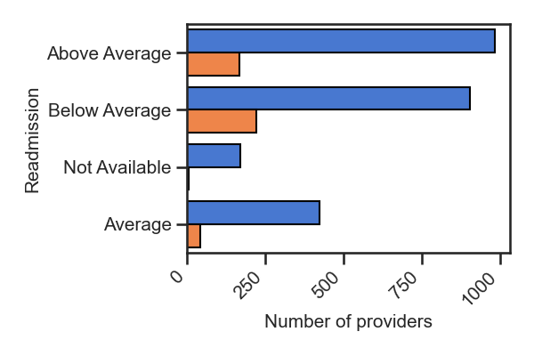
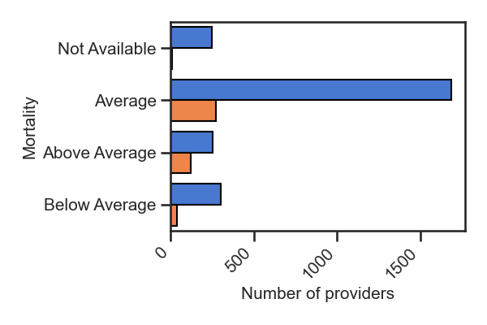
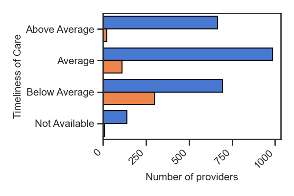
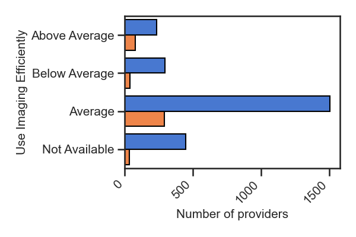
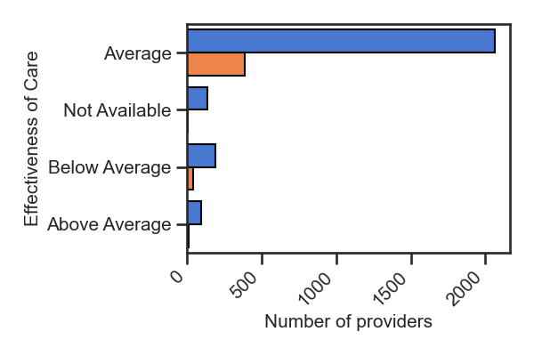
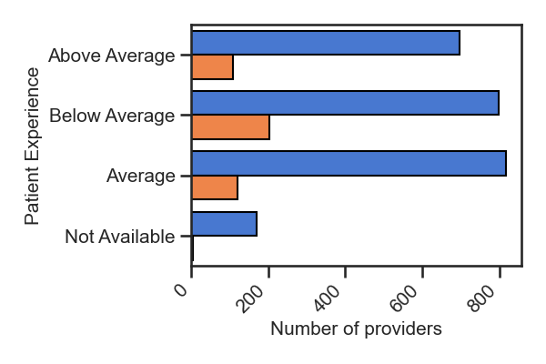
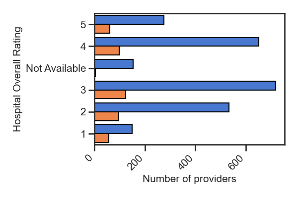

This is for the project entitled [Score hospitals by the billing behavior](https://github.com/HannahhoHe/Medicare---Insight-into-the-Bills/blob/master/README_Intro.md). In this asset, I used data are from [Kaggle CMS Medicare database](https://www.kaggle.com/cms/cms-medicare), which covers the US nationwide Medicare Service Quality Reviews for 2918 providers.
[See the codings](https://github.com/HannahhoHe/Medicare---Insight-into-the-Bills/blob/master/CROLChallenges_Section1.ipynb).

# 2nd asset - Are the higher bills associated with quality service? 
From the [1st asset](https://github.com/HannahhoHe/Medicare---Insight-into-the-Bills/blob/master/README.md), providers are classified as HiCharge vs. Regular Charge.
Here in the 2nd asset, the resultant HiCharge providers (orange) and RegularCharge providers (blue) are evaluated with factors associated with quality service.

## Do the HiCharge providers treat patients with better outcome?
Below the bar graphs show the distribution of providers with the readmission and mortality rates. The results demonstrated that the providers from the HiCharge class (orange) have an improved readmission rate as there are more of them with "Below Average" than with "Above Average", in contrast to the pattern from the RegularCharge providers (blue). However, these HiCharge providers do not seem to reduce the mortality rate but, on the other hand, have more than one-third with "Above Average", substantially higher than that of the RegularCharge class.          

## Are the HiCharge providers more effecieint?
Here, I chose measures of Timeliness of Care, Use Imaging Efficiently, and an overall Effectiveness of Care. From the three plots, it can be concluded that the HiCharge providers have a poor Timeliness rank (peaked with "Below Average"), and only at the average level in terms of efficiency either using imaging systems or in general.      

## Do the HiCharge providers give a better experience for patients?
The answer is negative. In fact, there are more HiCharge providers rated as "Below Average" than "Average" from patients perspective. 

## Do the HiCharge providers have better overall rating?
The distribution of providers from both calss appears similar to each other. 

# Conclusion
In general, a higher bill does not seem correlated with a better quality service. However, some may lower the patient readmission rate after treatment.  

