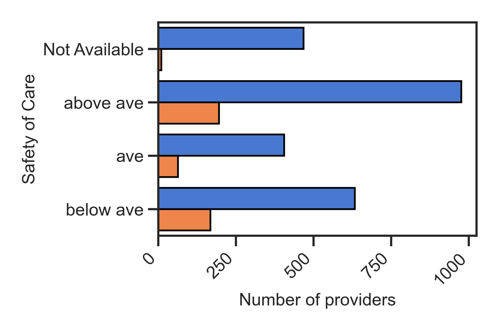

Data are from Kaggle CMS Medicare database, which covers the US nationwide Medicare bills from 3770 unique providers during the years of 2011-2015. 
# 2nd asset - Are the higher bills associated with quality service? 
In this asset, providers from different charge classes (HiCharge vs. RegularCharge) will be investigated with regard to the following quality services.    
|
